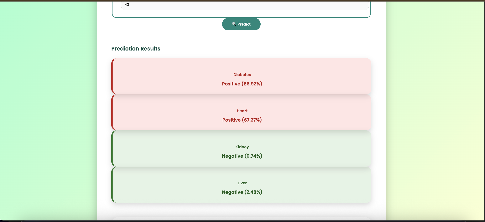
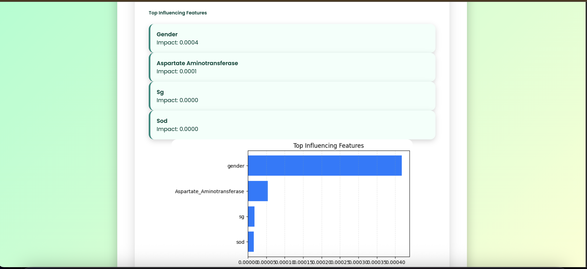
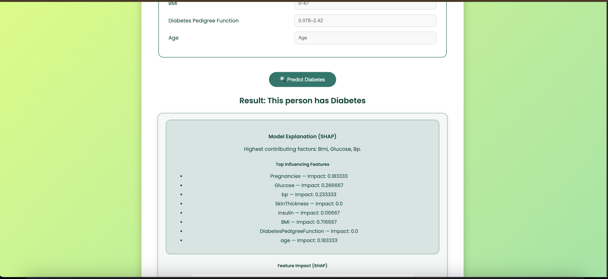
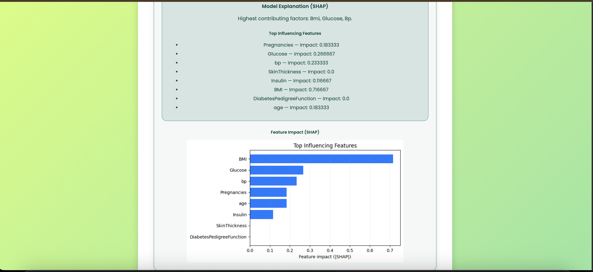
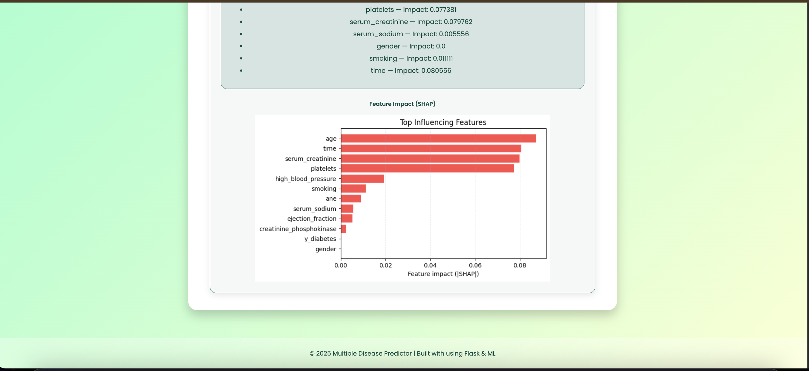
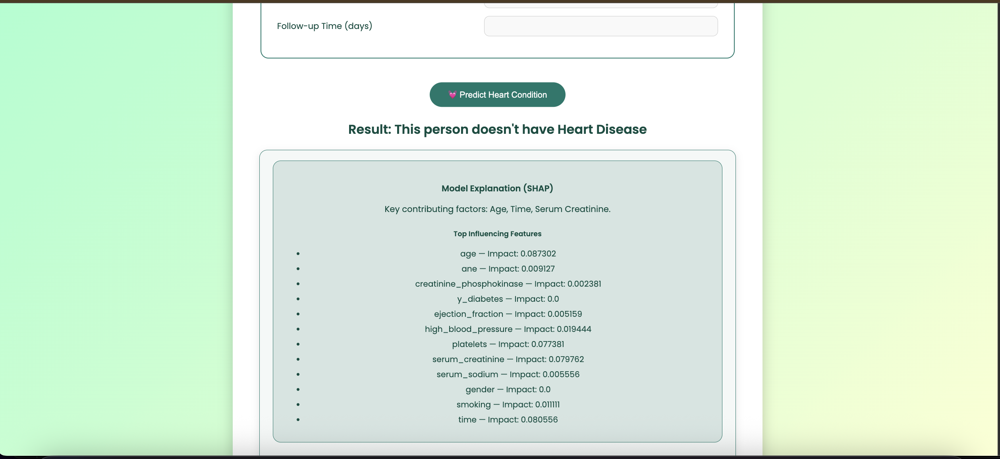
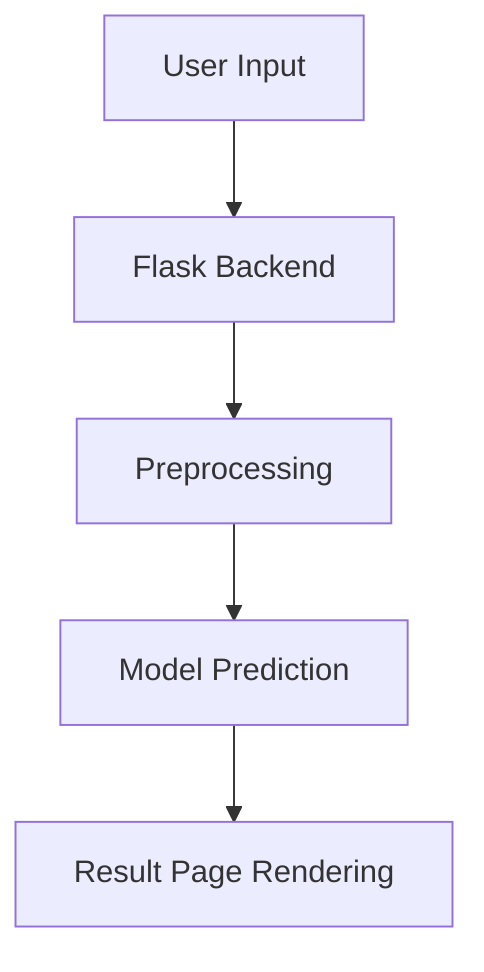

# Inter-Disease.AI

An integrated **AI-Driven Discovery of Multi-Condition Interactions** built using
**Flask + Deep Neural Network models**.
Combining a powerful inter-disease model with specialized single-disease predictors for deeper health insights.

------------------------------------------------------------------------

# 🚀 Overview

Inter-Disease.AI simplifies early health risk assessment by allowing
users to input medical parameters and instantly receive predictions for
multiple diseases.\
It serves as a complete end-to-end DL project: **datasets →
preprocessing → model training → web deployment**.

This project is ideal for: - Students learning ML deployment - Hackathon
prototypes - Demonstrating healthcare AI projects - Flask + ML
integration tutorials

------------------------------------------------------------------------

# ✨ Features

### 🔹 Multi‑Disease Prediction

-   Diabetes model (`diabetes_model.pkl`)
-   Heart disease model (`heart_model.pkl`)
-   Kidney disease model (`kidney_model.pkl`)
-   Liver disease model (`liver_model_final.pkl`)
-   Multi-disease deep learning model (`multi_disease_model1.h5`)

### 🔹 Interactive Web App

-   Clean HTML templates (`/templates`)
-   CSS/Images handled in `/static`
-   Easy-to-use input forms for each disease
-   Real-time prediction results

### 🔹 Dataset Rich

Datasets included: - `diabetes.csv` -
`heart_failure_clinical_records_dataset.csv` - `liver.csv` -
`kidney_disease.csv` - `combined_medical_dataset.csv`

### 🔹 Modular Architecture

-   ML models stored separately\
-   Web UI independent of ML logic\
-   Easy to update, replace, or retrain models

------------------------------------------------------------------------

# 📂 Project Structure

    Inter-Disease.AI/
    │
    ├── app.py                      # Main Flask application
    ├── requirements.txt            # Dependencies
    │
    ├── datasets/                   # (If you choose to reorganize)
    │   ├── diabetes.csv
    │   ├── heart_failure_clinical_records_dataset.csv
    │   ├── kidney_disease.csv
    │   ├── liver.csv
    │   ├── combined_medical_dataset.csv
    │
    ├── models/
    │   ├── diabetes_model.pkl
    │   ├── heart_model.pkl
    │   ├── kidney_model.pkl
    │   ├── liver_model_final.pkl
    │   ├── multi_disease_model1.h5
    │
    ├── templates/                  # Front-end UI
    │   ├── index.html
    │   ├── diabetes.html
    │   ├── heart.html
    │   ├── kidney.html
    │   ├── liver.html
    │   └── result.html
    │
    ├── static/                     # CSS + JS + Images
    │   ├── style.css
    │   └── images/
    │
    └── README.md                   # Project documentation

------------------------------------------------------------------------

# 🛠 Installation & Setup

### 1️⃣ Clone the Repository

``` bash
git clone https://github.com/akshat12375/Inter-Disease.AI
cd Inter-Disease.AI
```

### 2️⃣ Install Dependencies

``` bash
pip install -r requirements.txt
```

### 3️⃣ Run the Application

``` bash
python app.py
```

Open in your browser:

👉 http://127.0.0.1:5000/

------------------------------------------------------------------------

## 📸 Project Demo

Below are some screenshots demonstrating the Inter-Disease.AI interface and predictions.

<p align="center">
  
  <br/><br/>
  
  <br/><br/>
  
  <br/><br/>
  
  <br/><br/>
  
  <br/><br/>
  
  <br/><br/>
  
  <br/><br/>
</p>


# 🧠 How Predictions Work

Each disease model uses different input features:

### 🔸 Diabetes

-   Glucose\
-   Blood pressure\
-   BMI\
-   Insulin

### 🔸 Heart Disease

-   Age\
-   Anaemia\
-   Platelets\
-   Serum Creatinine

### 🔸 Kidney Disease

-   Blood Urea\
-   Serum Creatinine\
-   Sodium & Potassium levels

### 🔸 Liver Disease

-   ALT/AST enzymes\
-   Total Bilirubin\
-   Proteins and Albumin

### 🔹 Workflow

1.  User submits values\
2.  Model loads from `.pkl` or `.h5`\
3.  System preprocesses the inputs\
4.  Model predicts probability/risk\
5.  Result displayed on browser

------------------------------------------------------------------------

# 🧪 Sample Prediction Flow



------------------------------------------------------------------------

# 🌟 Future Improvements

-   Add more diseases (thyroid, stroke, Parkinson's)\
-   Deploy on cloud (Render, AWS, GCP)\
-   Add authentication + patient history\
-   Add graphs/visualizations\
-   Replace forms with a React front-end\
-   Add SHAP explainability dashboard

------------------------------------------------------------------------

# ⚠️ Disclaimer

This project is meant for **educational and demonstration purposes
only**.\
It is **NOT** a medical diagnostic tool.\
Always consult a certified doctor for health decisions.


------------------------------------------------------------------------

# 🙌 Acknowledgements

Thanks to the datasets from Kaggle and UCI ML repositories that helped
train the models.
